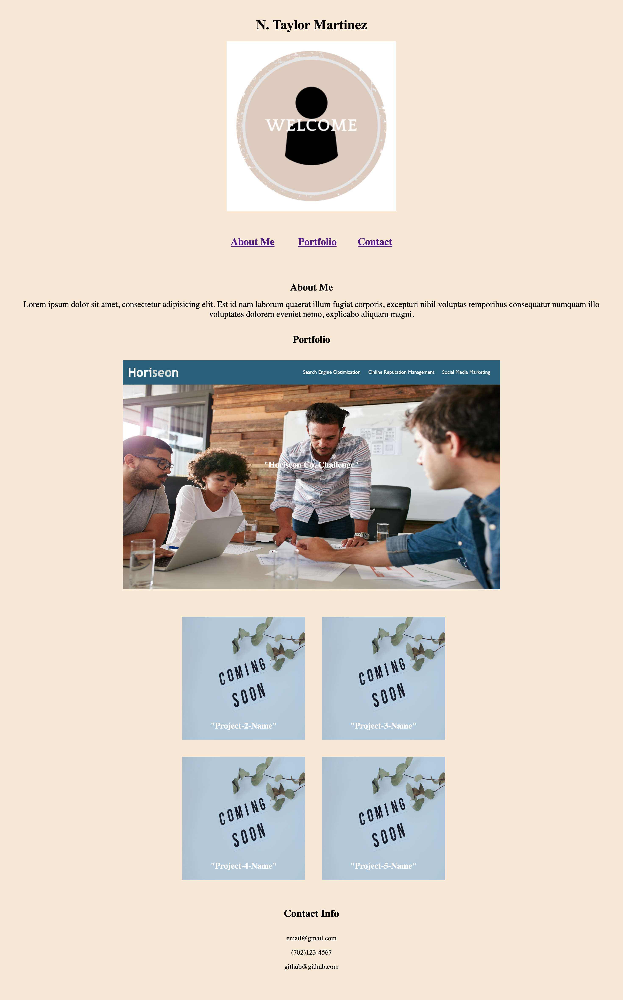

# professional-portfolio-repo

## A website displaying work samples for a potential employee.

## Description
Allows potential employers to view a prospective employees work samples and deployed applications, to assess if that candidate is hireable. This professional portfolio includes information about the cadidate, their work, and several different contact methods. Provides insight as to why the candidate would be a good hire for the position available.

## Visuals

## Installation
N/A

## Technologies
* css
* html

## Usage
To use this website, users may click on any one of the sections in the navigation bar to be directed to more information about that section. When users click on the 'Horiseon-Company-Image' they will be redirected to the deployed application to view in the browser. 

## Credits
Thanks to Scott Everett who assisted in the debugging process.

## License
MIT

## Project Status
This project will continue to be developed as creator expands work and professional portfolio resources.